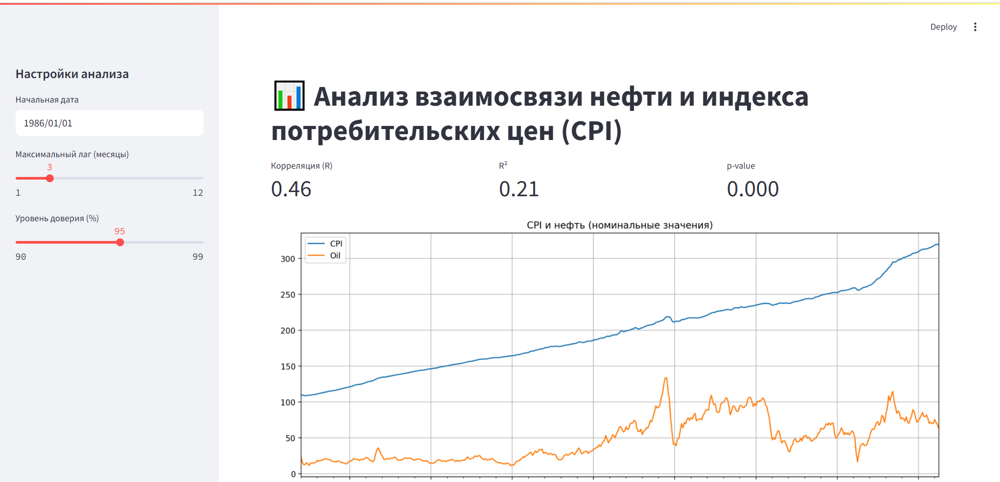

# Oil and CPI Analysis Dashboard

Streamlit Приложение для анализа взаимосвязи между ценами на нефть и индексом потребительских цен (CPI.).




# Features
- Анализ корреляции между ценами на нефть и индексом потребительских цен
- Создание отчетов в формате PDF
- Визуализация последствий с запаздыванием

# Installation

1. Клонируйте репозиторий:
```bash
git clone https://github.com/yourusername/oil-cpi-analysis.git
cd oil-cpi-analysis
```

2. Создайте и активируйте виртуальное окружение:
python -m venv venv
## Windows:
venv\Scripts\activate
## Mac/Linux:
source venv/bin/activate

3. Скачайте зависимости:
pip install -r requirements.txt

4. Добавьте шрифты:
- Скачайте DejaVuSans.ttf и DejaVuSans-Bold.ttf (https://dejavu-fonts.github.io)

5. Создайте конфигурационный файл:
cp config.py.example config.py
Затем измените config.py и добавьте ваш FRED API ключ (https://fred.stlouisfed.org/docs/api/api_key.html)

## Usage
streamlit run main.py
